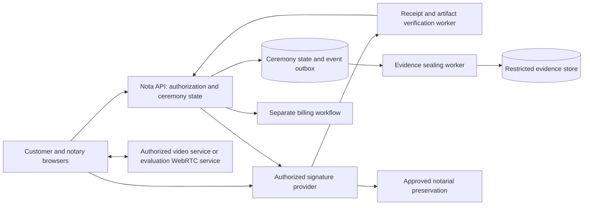

# Nota — secure signing ceremony and Chambre demonstration plan

Date: 2026-09-09. Status: proposed implementation and evaluation plan; no production approval or security certification. No application behavior is changed by this document.

Revision, 2026-09-09: the owner's follow-up makes customer-to-notary end-to-end media encryption, individual signup, separate identity proofing and an authorized final-signature workflow mandatory design requirements. See [testable security requirements](signing-security-requirements.md). A working technical rehearsal has since been implemented; [its actual capabilities and remaining gaps](signing-beta-release.md) are separate from this target legal workflow. Newer CNQ provider guidance also corrects the earlier Teams-only assumption below.

## Recommended direction

Build a notary-led signing room: a calm, full-screen customer experience that connects preparation, live face-to-face discussion, identity verification, document review, signing, and delivery of a certified copy. The notary controls admission, readiness, signature release, suspension, and closure. The customer can ask questions or stop throughout.

Interpret “face-to-face conference” as synchronous video with the notary and each required participant visible. This is distinct from physical presence. Preserve an in-person digital signing route when remote execution is inappropriate.

The objective is a demonstrably controlled process with evidence for every important claim. “100% secure,” “100% compliant,” and “approved by the Chambre” are not launch claims we can substantiate today. Approval depends on the applicable rules, the implemented system, operating procedures, and external review. A successful demonstration should earn agreement on a bounded evaluation, rather than imply endorsement.

## Regulatory findings and decisions

Sources were consulted on 2026-09-09. Public guidance does not establish access to current member-only norms or permission for a particular integration. Reconfirm the applicable versions and commencement provisions with a practising Quebec notary before a live pilot.

| Finding | Consequence for Nota | Evidence / unresolved point |
| --- | --- | --- |
| Remote execution is exceptional and authorized by the notary; the ordinary rule is physical presence. | Record the party's request, the notary's reasons and authorization; permit revocation. A customer's selection of an online option or payment for urgency is insufficient. | [Loi sur le notariat, art. 46](https://www.legisquebec.gouv.qc.ca/fr/document/lc/N-3); [CNQ public guidance](https://www.cnq.org/votre-notaire/un-professionnel-numerique/signer-un-acte-notarie-technologique/). |
| Newer CNQ provider guidance lists criteria for video services other than Teams; mandatory solutions remain ConsignO Cloud-CNQ for closure, CertifO for the notary's official signature, and the stated approved preservation services. | Assess a Nota WebRTC service against the current video criteria. Keep closure and preservation in the authorized ecosystem; verify integration rights. | [Current CNQ provider guidance](https://www.cnq.org/fournisseurs-de-solutions-technologiques-aux-notaires/). This corrects the earlier Teams-only inference from the older [v15 guidelines](https://www.cnq.org/wp-content/uploads/2023/08/279439-2023_08_09_directives_normes_acte_techno_v15.pdf). |
| ConsignO Cloud publishes API and embedded-signer capabilities. | Investigate an adapter, but require written confirmation of CNQ-specific API access, embedding, signature control, and contractual rights. | [Notarius API documentation](https://support.notarius.com/wp-content/uploads/api/consigno-cloud-api-en.html). General product documentation does not establish CNQ integration eligibility. |
| Personal information must be necessary for its purpose; consent does not cure unnecessary collection. | Recording is a separate privacy decision. Default it off until purpose, necessity, access, and retention are approved. | [CAI collection guidance](https://www.cai.gouv.qc.ca/protection-renseignements-personnels/information-entreprises-privees/collecte-renseignements-personnels_entreprises). |
| Privacy review must address the new system and external processing. | Complete an EFVP, allocate controller/service-provider responsibilities, assess transfers and support access, and execute appropriate agreements. | [Private-sector privacy law, including arts. 3.3 and 17](https://www.legisquebec.gouv.qc.ca/fr/document/lc/P-39.1); [CAI external communication guidance](https://www.cai.gouv.qc.ca/protection-renseignements-personnels/information-entreprises-privees/utilisation-communication-renseignements-personnels). Canadian hosting alone does not settle Quebec transfer requirements. |

Use two explicit tracks:

1. **Authorized signing integration:** Nota handles preparation and ceremony coordination around ConsignO Cloud-CNQ, the notary's CertifO credential and approved preservation. Validate provider-specific integration rights and ceremony behavior; support a deliberate handoff if embedding is unavailable. A general embedded-signing API does not prove CNQ-specific access.
2. **Integrated WebRTC evaluation:** demonstrate the full-screen room with synthetic identities and non-operative documents. Evaluate it against the current alternative-video criteria and professional obligations before a live pilot. Establish which authorizations/declarations apply to Nota's precise role. A feature flag prevents production access.

The CNQ provider page states that identity-check solutions are not homologated by the Chambre, and its voluntary provider-homologation process is currently suspended. Do not promise either label. Mandatory authorization for closure, preservation and official signature services is distinct. [CNQ provider guidance](https://www.cnq.org/fournisseurs-de-solutions-technologiques-aux-notaires/)

The linked alternative-video criteria cover encryption in transit and at rest, Canadian data hosting, free customer participation without installation, and consideration of a lobby and technical support. E2EE is an additional owner requirement, beyond simply satisfying those encryption criteria. Map each requirement to deployed evidence, including media relays and operational data. [CNQ alternative-video criteria, 2023-11-09](https://www.cnq.org/wp-content/uploads/2023/11/442189-2023_11_09_criteres_choix_visioconference.pdf)

For an approved integration, first classify Nota's role with the Chambre and Notarius. The published closure specification requires prior authorization and provider compliance/audit steps for practice-software integrations ("Intégration à un LGÉ," pp. 14–15), and specifies PDF/A and PAdES-Baseline-LTA (§8.6). An independent closure service has a substantially larger authorization and assurance scope, including ISO 27001 and annual SOC 2 Type 2 reporting. These are classification-dependent requirements, not certifications Nota already holds. [CNQ closure specification v1.1, 2024-07-26](https://www.cnq.org/wp-content/uploads/2024/07/877502-2024_07_26_cahier_charges_solution_cloture_v1.1.pdf)

Neither track bypasses deed-specific formalities. Begin with one approved act type, ordinary adult participants and a documented geographic scope. Have counsel identify exclusions and requirements for witnesses, representation, incapacity concerns, interpreters, foreign participants and lender/registry acceptance. Do not treat an electronic signature as completion of the entire underlying transaction.

## Customer and notary experience

### Before the appointment

- The retained dossier opens a signing preparation page. The notary confirms eligibility, participant roles, act type, intended location and the final appointment time.
- Each participant must create an individual account, verify their personal email and enroll a phishing-resistant authenticator such as a passkey. Use an accessible, reviewed alternative where needed; never share accounts. Require fresh authentication before entering the room and releasing a signature. Account recovery must re-establish trust rather than bypass this gate.
- Account authentication and legal identity are separate. Bind a reviewed identity-proofing outcome to the account and invitation, then let the notary verify identity, authority, capacity and willingness during the live encounter. Validate the notary's professional status and official signing credential separately. No automatic provider score can approve capacity or consent.
- A device check tests camera, microphone, speaker, connectivity and document readability. Explain privacy expectations, assistance and in-person alternatives. Collect only required identity evidence through the approved secure channel.
- Review the draft ahead of time. Recording notice and consent, if applicable, remain separate from consent to the act. No recording starts in the waiting room.

### The signing room

A quiet, generously spaced layout uses the document as the main surface and maintains visible participant video beside it. A small progress rail reads preparation → verification → review → signature → copy. All required participants remain observable during the signature gestures; a camera picture of a face alone may be inadequate.

Offer full-screen after an explicit click, with keyboard navigation, zoom, readable contrast and an obvious exit. Full-screen is a focus feature, not a security boundary: a browser cannot prevent external cameras, screenshots, other devices or operating-system interruptions. Losing full-screen does not invalidate an act by itself. Loss of required observation suspends signature release.

The notary admits named participants from a lobby, verifies the roster, and locks admission. New participants require a fresh admission decision; required witness visibility is handled explicitly. A private conversation mode pauses the signing sequence and any recording, with a clear indication of who can hear.

During review, the notary guides pages while the customer can inspect the document independently. The room always identifies the document version and shows unanswered questions. Page visits are not treated as proof of understanding. The notary records the readiness decision after discussion.

### Signature and closure

1. The server fixes the document and annex versions, party roster, required signature order, and signing-provider project identity.
2. The notary authorizes a specific participant's signature step. The signer confirms intent and completes the provider's authentication and signature process. A drawn signature image alone is not the evidence model.
3. The notary applies their official signature immediately after the final party's signature within the required notary-controlled sequence, using their own authorized credential. Prove the full sequence before releasing signatures; do not insert an asynchronous closure queue. Nota never stores or uses that private signing credential on their behalf. [CNQ closure specification, §3(d)](https://www.cnq.org/wp-content/uploads/2024/07/877502-2024_07_26_cahier_charges_solution_cloture_v1.1.pdf)
4. The system verifies provider evidence against the intended signers and document lineage. No browser callback alone can mark the act signed. Delayed verification affects Nota's confirmation status, not the legal effect of a signature already applied.
5. Validate the completed artifact and preservation receipt. Track legal closure, copy availability and payment separately: a later payment or archival service outage must not falsely reverse an already executed act.
6. Deliver the notary-issued certified copy through the authorized secure channel, with validation instructions and a receipt. Nota's event manifest is supporting evidence, not a certified notarial copy.

Proposed bilingual copy for the eventual implementation:

| fr-CA canonical | English |
| --- | --- |
| Votre rendez-vous de signature | Your signing appointment |
| Votre notaire vous accompagne à chaque étape. | Your notary guides you through every step. |
| Activer le plein écran | Enter full screen |
| Demander une pause | Request a pause |
| Signature suspendue — votre notaire doit rétablir la connexion. | Signing paused — your notary must restore the connection. |
| Enregistrement en cours | Recording in progress |
| Copie certifiée conforme disponible | Certified true copy available |
| Démonstration — aucun acte juridique n’est conclu. | Demonstration — no legal act is executed. |

## Recording and signed evidence

Strict customer-to-notary E2EE is the default required mode, with server recording, transcription and AI assistants disabled. No source reviewed establishes blanket mandatory video recording. If recording remains desired, counsel and the privacy lead must assess endpoint capture or an expressly disclosed additional recipient as a separate mode; adding a server recorder that receives plaintext does not meet the two-endpoint promise. Never downgrade encryption silently to enable recording.

If authorized, show the purpose, recipients, retention period and consequences of refusal before asking every affected participant for explicit consent. Show a persistent recording indicator, record consent version/time, and require renewed consent for a newly admitted participant. A withdrawal stops future capture; handling existing material follows the approved policy and lawful preservation obligations. Offer a non-recorded or in-person route where permitted.

Treat these as separate objects with separate access and retention policies:

| Object | Proposed handling |
| --- | --- |
| Original act and signature-provider journal | Authoritative preservation under the notary's approved custody workflow; Nota keeps verified references unless additional storage is authorized. |
| Certified customer copy | Delivered under the notary's authority; accessible only to authorized recipients. |
| Ceremony event evidence | Minimized structured events, actor, server UTC time, sequence, document/version references, decision references and provider receipts. |
| Optional video/audio | Dedicated encrypted storage and keys; restricted replay/export, access logging, approved short retention, legal-hold handling and verified deletion. No default customer download. |
| Identity evidence | Store verification outcomes and necessary references; isolate any required identity images. Do not copy them into analytics, general logs or exports. |

For permitted recordings, hash ordered chunks and seal a final manifest containing session ID, chunk hashes, time range, gaps and consent-event references. Sign the manifest using a protected service key and obtain an independent timestamp where supported. Clearly distinguish this service signature from the notary's official signature. An incomplete recording is labelled incomplete; no fabricated continuity.

Hash chaining alone does not prevent a privileged operator rewriting history. Anchor manifests outside the mutable application database, restrict signing-key use, retain verifiable key identifiers and audit access. These controls show integrity since sealing; they do not prove capacity, voluntariness or the absence of off-camera coercion.

## Proposed architecture and security controls

The WebRTC evaluation requires authenticated peer-key binding, short-lived room grants, DTLS-SRTP media encryption and protected TURN credentials. Reject unverified peers and any attempted encryption downgrade. Media keys must remain with the authenticated customer and notary endpoints in the two-person mode; a relay may handle ciphertext only. WebRTC supplies transport security primitives, not legal identity or an independently authenticated roster. [IETF RFC 8827](https://www.rfc-editor.org/rfc/rfc8827.html)

For the evaluation, choose a managed or dedicated media service after a Canadian-region and subprocessor review. Lambda remains the control plane; it does not relay live media. A two-person prototype can use peer-to-peer connections with TURN. Multiple signers, witnesses and recording require a deliberately designed media topology and capacity plan.

Do not call a conventional SFU connection end-to-end encrypted against the service operator. An SFU path must additionally encrypt media at the application layer using a reviewed protocol and implementation; validate browser support, authenticated key distribution, membership rotation and failure behavior. If a required witness joins, explicitly show that the encryption group now includes that witness, rekey, and recheck signing prerequisites. Browser-side recording has tampering and interruption limitations; it cannot be the sole authoritative evidence source.

The security statement must also disclose trust in the endpoint and the delivered application. A compromised browser, device or Nota deployment can access plaintext before encryption. Protect releases and keys, independently test this boundary, and never claim E2EE makes that attack impossible. Use separate, truthful status indicators for account authentication, notary identity approval, media protection and signature validation; never collapse them into an unsupported “100% compliant” badge.

| Threat | Required implementation and demonstrable evidence |
| --- | --- |
| Stolen invitation or account | Single-use expiring invitations; server-side membership checks; stronger notary authentication and step-up for sensitive actions; independent identity verification; tested session revocation. |
| Unauthorized participant or staff access | Bind grants to dossier, actor, role and session; lobby admission; no reusable public room link; no default support/admin content access; auditable exceptional access policy. |
| Document substitution | Immutable unsigned version and annex manifest; provider project binding; validation of signed PDF revisions and signature coverage. Final signed bytes naturally differ from unsigned bytes—verify permitted changes, not naive hash equality. |
| Replayed, forged or delayed provider event | Authenticate events where supported, reconcile against provider API, enforce idempotency and sequence, verify certificate chain/revocation evidence and supported long-term validation profile. Unknown results stay pending. |
| Disconnect or hidden signer | Suspend release when observation fails; revoke outstanding signing capability where provider supports it; reconcile in-flight signatures before resume. Notary rechecks presence and readiness. |
| Provider cannot prevent unattended signing | Reject that integration for the gated ceremony; a disabled Nota button does not revoke an independently usable provider link. Prove provider-side gating in a technical spike. |
| Malicious document or web script | Scan uploads, use isolated document rendering, restrictive CSP and Permissions Policy, protect cross-origin messages and CSRF boundaries, exclude third-party analytics from the room. |
| Privileged tampering or sensitive-data leakage | Separate encryption/signing keys and roles; minimal logs; protected evidence manifests; audited export; deployment evidence for cloud controls. |
| Outage during closure | Durable outbox, conditional state writes and reconciliation; no duplicate signature project or charge; keep legally closed acts distinct from pending preservation/delivery. |
| Deepfake, coercion or compromised device | Notary-led verification and stop/escalation procedure. Automated checks must not promise detection of every attack or replace professional judgment. |

Do not introduce face recognition, voiceprints, AI meeting transcription or model training as hidden features. Any future biometric processing requires its own legal/privacy assessment before implementation.

## Integration with the existing repository

The inspected tree contains dossier documents, authentication, transaction audit and billing completion, but no WebRTC or ConsignO ceremony implementation was found in `apps`, `packages` or `infra`. These are code observations, not an assessment of deployed controls.

| Area | Planned work |
| --- | --- |
| `packages/domain/index.js` | Add pure ceremony transitions, participant requirements and approved retention categories with tests and BDD. Keep cryptography, I/O and billing outside the domain. Do not encode an urgency selection as remote legal authorization. |
| `apps/api/src/handler.js` and new ceremony modules | Enforce dossier ownership and versioned transitions; persist authorization decisions; issue grants; coordinate signature-provider and evidence adapters. |
| `apps/api/src/billing.js` | Consume a verified closure reference through an idempotent workflow. Preserve approved commercial rules; this project makes no pricing decision. |
| `apps/web/public` | Vanilla JS room/preflight screens and i18n entries; no runtime dependencies. External SDK requirements must be resolved through an approved boundary or explicit repository-rule change before adoption. |
| `apps/admin` | Operational health and redacted status; no room access, recording replay or signing credentials by default. Preserve noindex. |
| `infra` | Separate evidence storage and lifecycle, KMS permissions, signaling/media service, worker queue, observability and deletion verification. Verify deployed state before asserting controls work. |
| API specifications and tests | Document proposed endpoints in OpenAPI when implemented; run domain/API, web, admin, BDD and ceremony browser tests. |

Two specific gaps require attention:

- `POST /notary/acts/complete` currently validates retained ownership and act value, then settles billing without checking a cryptographic ceremony receipt. For Nota-managed ceremonies, enforce verified closure in the server before settlement; preserve an explicit, separately evidenced workflow for acts executed outside Nota. Payment failure must never change the act's legal signature status.
- `infra/documents.tf` expires ordinary message-document objects after 400 days from creation. Do not store authoritative minutes or ceremony evidence there by default. The new retention matrix must address originals, copies, recordings, keys, backups and legal holds independently.

Repository governance also needs reconciliation before external review: `AGENTS.md` describes a commission model while later legal documents and decisions describe separate Nota pricing. Record this as an existing unresolved documentation conflict; do not use the signing project to silently choose or change either model.

### Server workflow and proposed endpoints

Proposed lifecycle: `DRAFT → ELIGIBILITY_APPROVED → READY → IN_SESSION → REVIEWED → SIGNING → CLOSED`. `SUSPENDED` can interrupt active stages; `ABORTED` ends an unclosed attempt. Resume requires a notary decision after rechecking identity/presence and provider state. Changes to document content create a new version and revalidation; already signed material is preserved, never overwritten.

Track `evidenceStatus`, `preservationStatus`, `copyStatus` and `paymentStatus` separately. `CLOSED` requires verified provider completion and notary closure evidence. Preservation or delivery can remain pending after closure with an operational alert.

Candidate endpoints: `POST /signing-sessions`, `GET /signing-sessions/{id}`, and role-scoped commands for `/eligibility`, `/admissions`, `/review`, `/signature-release`, `/suspend`, `/resume`, `/abort` and `/recording-consents`; server-only provider-event ingestion; restricted `/evidence` retrieval. These are design proposals, not current API routes.

Every mutation validates the session's current version, authenticated actor, dossier membership and idempotency key. Persist business state and its event atomically, then deliver external effects through an outbox. Events record server UTC instants; existing appointment dates remain ISO civil dates. Never allow arbitrary client-supplied transitions or client-declared “verified” status.

## Demonstration for the Chambre

Working title: **Votre notaire, présent à chaque étape.**

Prepare a 12-minute demonstration with a practising notary, a customer actor, a second participant and an observer. Use fictional documents marked as demonstration material and separate sandbox accounts. Show the exact code revision and label real integrations, simulated steps and unapproved capabilities. A rehearsed fallback video must be identified as a recording.

| Time | Scene | What the reviewer can inspect |
| --- | --- | --- |
| 0–2 min | Customer prepares and notary authorizes the remote request. | Accessibility, individual admission, reasons and human control. |
| 2–4 min | Full-screen discussion and guided review. | Participant visibility, document version, questions and pause control. |
| 4–6 min | Attempt entry with an unauthorized identity; disconnect the signer. | Access denied; signing suspended; pending provider operation reconciled. |
| 6–8 min | Resume, authenticate and sign the fixed document. | Correct order, provider receipt and notary official-signature step, or clearly labelled sandbox equivalent. |
| 8–10 min | Open the evidence summary; alter a copied document. | Integrity verification fails on the altered copy. A replayed completion event does not create a second charge. |
| 10–12 min | Deliver the copy and review the pilot proposal. | Custody reference, customer receipt, unresolved approvals and named owners. |

Optional separate recording scene: obtain the actors' consent, start capture, show the persistent indicator, stop it, seal the manifest, and demonstrate an unauthorized replay denial. Use synthetic data and actor permission even in the demonstration. Do not present recorded video as a substitute for the signed act.

The meeting request should be concrete: identify a technical/legal contact, confirm the governing norms and integration process, review the evidence/recording design, and agree on whether a small supervised evaluation is appropriate. Ask who has authority to authorize each element; an encouraging meeting is not authorization.

Provide a review pack: architecture/data-flow diagram, requirement/control/evidence matrix, act-type scope, EFVP draft, vendor/subprocessor list, threat model, independent testing plan, demonstration script, retention schedule and issues register. Put a practising notary in the lead for the legal ceremony.

## Delivery sequence and acceptance gates

Planning estimate only: approximately 8–12 engineering weeks with two engineers, product/design support, a practising notary, privacy/legal counsel and an independent security reviewer. External provider access and regulatory review have unknown lead times and can extend the schedule. A synthetic demonstration can precede live-pilot authorization.

This estimate assumes integration with authorized signing services, not creating a newly authorized closure provider. The strict E2EE requirement adds an early feasibility gate: independently reviewed identity/key binding, compatible browsers, and provider-side signature control must be proven before committing to the implementation schedule. A native-client fallback requires an explicit experience decision; current Teams E2EE excludes browser participants and recording/transcription. [Microsoft Teams E2EE](https://learn.microsoft.com/en-us/microsoftteams/teams-end-to-end-encryption)

| Phase | Approximate effort | Exit evidence |
| --- | --- | --- |
| 0. Scope and feasibility | Weeks 1–2 | Notary/counsel identify applicable norms, act type and exceptions. Providers confirm CNQ access, embedding, live signature gating, exports and data locations. Privacy lead drafts EFVP and recording decision. |
| 1. Customer experience | Weeks 2–3 | Bilingual accessible prototype; two-device video evaluation; visible simulation labels; rehearsal with notary and representative users. |
| 2. Server authority and provider integration | Weeks 3–6 | Tested state transitions, immutable versions, authentication, provider reconciliation, closure evidence and billing separation. |
| 3. Evidence and operations | Weeks 6–8 | Evidence export/verification, retention enforcement, restore drill, incident procedure, access review and recording controls if authorized. |
| 4. Validation and demonstration | Weeks 8–10 | Independent penetration test, fixed critical/high findings, browser/accessibility tests, legal review of the exact flow and rehearsed demonstration. |
| 5. Limited live pilot | Weeks 10–12 or later | All required permissions, contracts and reviews complete; support owners ready; restricted rollout and agreed stop criteria. |

Before committing to a budget, obtain quotes for CNQ-capable signing access, media/TURN usage, permitted recording storage, regional processing, legal review and independent testing. Model expected session duration, concurrency, recording rate and retention. Do not infer CNQ licensing or unit costs from a generic signature API.

Mandatory acceptance scenarios: invitation replay; wrong-dossier access; revoked notary session; stale document signature; annex substitution; absent witness; recording refusal/withdrawal; late participant; disconnect during an in-flight signature; forged/reordered provider events; expired or revoked certificate; unavailable provider; successful closure with failed payment; failed preservation export; restoration from backup; verified retention deletion; keyboard-only and mobile completion. Inspect the underlying evidence, not just the UI toast.

For implementation, run `npm test`, `npm run test:web`, `npm run test:admin`, the `features` suite and relevant browser tests, plus web/admin builds. Run `npm run local:check` before trusting local API observations. This planning-only change requires no runtime test execution.

Pilot success criteria should be agreed in advance: zero unauthorized disclosures or premature closure events; independently reproducible verification for every completed pilot act; every remote session has a documented eligibility decision; customers can pause and understand the next step; the notary can explain the evidence without engineering assistance. Measure completion and setup time as usability results, not pressure to accelerate professional advice.

Any unexplained evidence mismatch, unauthorized access, loss of required observation without suspension, or inability to verify custody stops new pilot ceremonies. Reconcile existing provider state without deleting signed artifacts. The owner, practising notary and security lead decide recovery within their respective responsibilities.

The first build milestone is the provider feasibility spike and the synthetic signing-room prototype. A credible demonstration shows both a smooth ceremony and the system refusing to proceed when its prerequisites fail.
